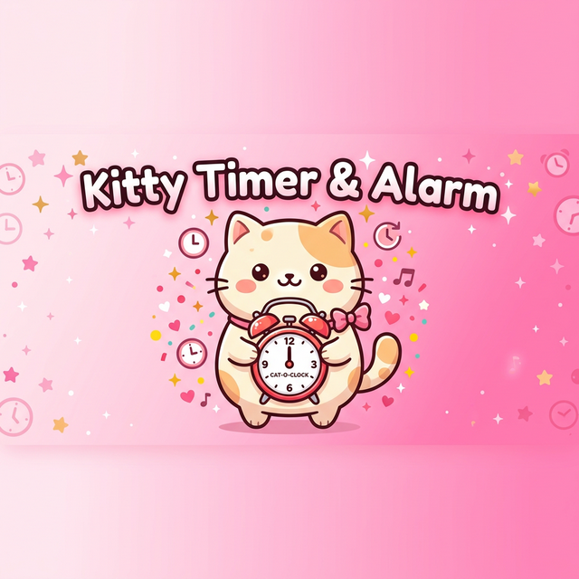
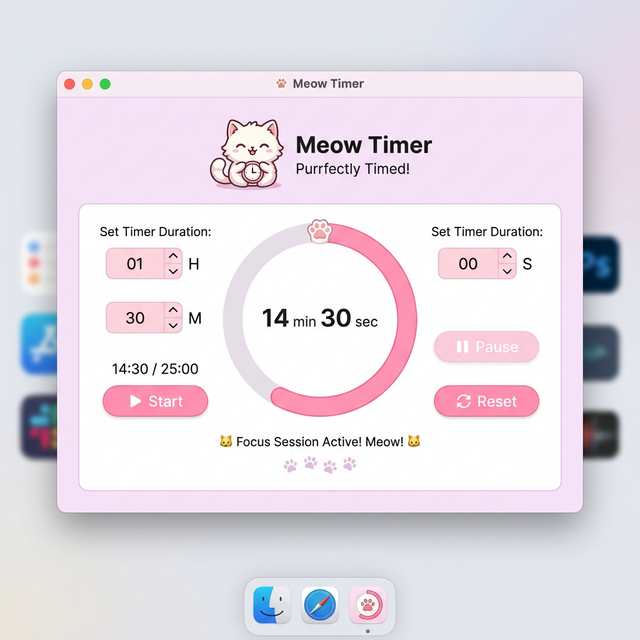
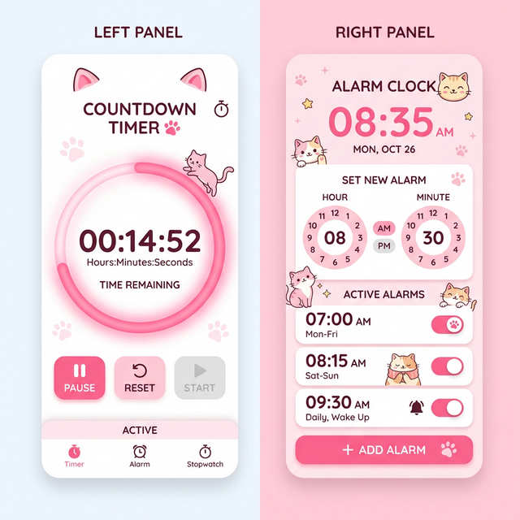
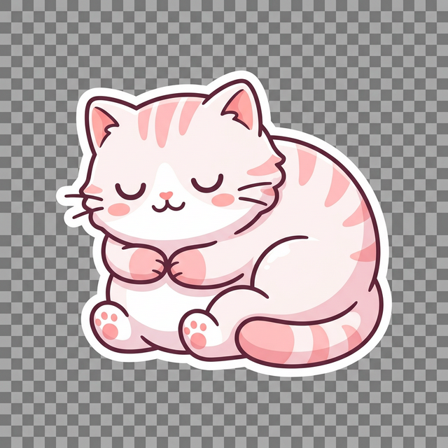
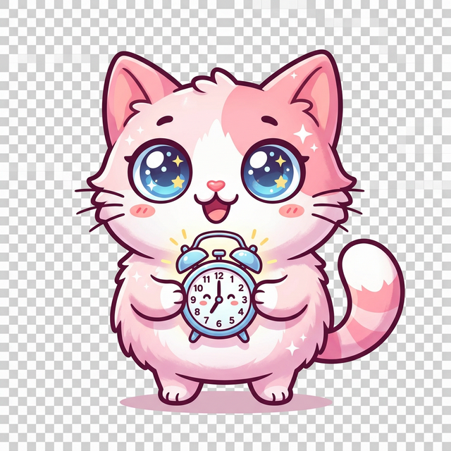

<div align="center">

<!-- Banner -->


<br>

<!-- Animated Title -->
<h1>
  
</h1>

<!-- Badges -->
<p>
  <a href="https://github.com/1sarthak7/cat-timer/stargazers">
    
  </a>
  <a href="https://github.com/1sarthak7/cat-timer/network/members">
    
  </a>
  <a href="https://github.com/1sarthak7/cat-timer/issues">
    
  </a>
  <a href="https://github.com/1sarthak7/cat-timer/blob/main/LICENSE">
    
  </a>
</p>

<!-- Tech Stack Badges -->
<p>
  
  
  
  
</p>

<!-- Short Description -->
<p>
  <b>A cute, pink-themed desktop timer & alarm clock with adorable cat mascot animations 🐾</b>
</p>

<br>

<!-- Wave Divider -->


</div>

<br>

## 🌸 Preview

<div align="center">

<table>
  <tr>
    <td align="center" width="50%">
      
      <br>
      <b>⏱ Timer Tab</b>
    </td>
    <td align="center" width="50%">
      
      <br>
      <b>⏰ Alarm Tab</b>
    </td>
  </tr>
</table>

</div>

<br>

<div align="center">

</div>

<br>

## ✨ Features

<div align="center">

| 🎀 Feature | 📝 Description |
|:---|:---|
| ⏱ **Countdown Timer** | Set hours, minutes & seconds with a beautiful circular progress ring |
| ⏰ **Alarm Clock** | Set multiple alarms with AM/PM toggle and live clock display |
| 🐱 **Cat Mascot** | Adorable kawaii cat that reacts — sleeps, watches, and celebrates! |
| 🔔 **Sound Alerts** | Cross-platform system sounds when timer ends or alarm fires |
| 🎨 **Pink Theme** | Gorgeous pastel pink UI with soft gradients and glowing accents |
| ✨ **Rich Animations** | 11+ smooth animations throughout the entire app |

</div>

<br>

<div align="center">

</div>

<br>

## 🎬 Animations

<div align="center">

> *Every interaction in Kitty Timer is animated for a delightful experience!*

</div>

<br>

<table>
  <tr>
    <td>🖱️</td>
    <td><b>Button Hover Fade</b></td>
    <td>Smooth color interpolation from base → hover color using cubic easing</td>
  </tr>
  <tr>
    <td>💫</td>
    <td><b>Button Ripple Effect</b></td>
    <td>Expanding circle ripple from the exact click point on every button press</td>
  </tr>
  <tr>
    <td>🐱</td>
    <td><b>Cat Idle Bobbing</b></td>
    <td>Gentle sine-wave floating animation (4px amplitude) when the cat is idle</td>
  </tr>
  <tr>
    <td>💤</td>
    <td><b>Floating ZzZ</b></td>
    <td>Animated "zzZ" text particles float above the sleeping cat with color shifts</td>
  </tr>
  <tr>
    <td>🎾</td>
    <td><b>Cat Bounce Transition</b></td>
    <td>Elastic overshoot bounce when the cat changes between sleeping → alert → celebrate</td>
  </tr>
  <tr>
    <td>✍️</td>
    <td><b>Typewriter Text</b></td>
    <td>Character-by-character text reveal with gradient color fade from accent → normal</td>
  </tr>
  <tr>
    <td>🌈</td>
    <td><b>Gradient Progress Ring</b></td>
    <td>Multi-layer arc with gradient shading and outer glow rings for depth</td>
  </tr>
  <tr>
    <td>💎</td>
    <td><b>Glowing Ring Tip</b></td>
    <td>Luminous dot at the progress tip with layered glow halos</td>
  </tr>
  <tr>
    <td>🎆</td>
    <td><b>Sparkle Explosion</b></td>
    <td>30-particle burst of stars, diamonds & circles with gravity and rotation on timer completion</td>
  </tr>
  <tr>
    <td>📥</td>
    <td><b>Alarm Card Slide-In</b></td>
    <td>New alarms appear with a pink highlight flash that fades smoothly</td>
  </tr>
  <tr>
    <td>📤</td>
    <td><b>Alarm Card Fade-Out</b></td>
    <td>Deleted alarms dissolve with color fade + border shrink before removal</td>
  </tr>
  <tr>
    <td>✨</td>
    <td><b>Header Glow Pulse</b></td>
    <td>Subtle sinusoidal color cycling on the app title text</td>
  </tr>
  <tr>
    <td>⚡</td>
    <td><b>Timer Flash</b></td>
    <td>Alternating background flash effect when timer completes</td>
  </tr>
  <tr>
    <td>🔴</td>
    <td><b>Clock Flash</b></td>
    <td>Rapid color alternation on the clock display when an alarm triggers</td>
  </tr>
  <tr>
    <td>🎯</td>
    <td><b>Smooth Ring Fill</b></td>
    <td>Eased interpolation animation when ring fills to 100% or resets to 0%</td>
  </tr>
  <tr>
    <td>❌</td>
    <td><b>Delete Button Hover</b></td>
    <td>Circle highlight appears behind the ✕ icon on mouse hover</td>
  </tr>
</table>

<br>

<div align="center">

</div>

<br>

## 🐱 Meet the Mascot

<div align="center">

<table>
  <tr>
    <td align="center">
      
      <br>
      <b>😴 Sleeping</b>
      <br>
      <sub>Idle & waiting for you</sub>
    </td>
    <td align="center">
      
      <br>
      <b>😺 Alert</b>
      <br>
      <sub>Timer running / Alarm set</sub>
    </td>
    <td align="center">
      
      <br>
      <b>🎉 Celebrate</b>
      <br>
      <sub>Time's up! Great job!</sub>
    </td>
  </tr>
</table>

</div>

<br>

<div align="center">

</div>

<br>

## 🚀 Quick Start

### Prerequisites

- Python 3.10 or higher
- pip (Python package manager)

### Installation

```bash
# Clone the repository
git clone https://github.com/1sarthak7/cat-timer.git

# Navigate to the project
cd cat-timer

# Create virtual environment
python3 -m venv venv

# Activate virtual environment
source venv/bin/activate        # macOS/Linux
# venv\Scripts\activate         # Windows

# Install dependencies
pip install Pillow

# Run the app! 🐱
python3 app.py
```

<br>

<div align="center">

</div>

<br>

## 📁 Project Structure

```
cat-timer/
├── 🐍 app.py                  # Main application (~680 lines)
├── 📁 assets/
│   ├── 🐱 cat_sleeping.png    # Sleeping cat mascot
│   ├── 🐱 cat_alert.png       # Alert cat mascot
│   ├── 🐱 cat_celebrate.png   # Celebrating cat mascot
│   ├── 🖼️ banner.png          # README banner
│   ├── 🖼️ app_preview.png     # App preview image
│   └── 🖼️ features_preview.png # Features preview
├── 📄 README.md
└── 📁 venv/                   # Virtual environment
```

<br>

<div align="center">

</div>

<br>

## 🎨 Color Palette

<div align="center">

| Color | Hex | Usage |
|:---:|:---:|:---|
|  | `#E75480` | Dark Pink — Headers, primary text |
|  | `#FF69B4` | Hot Pink — Main buttons, active tabs |
|  | `#FFB6C1` | Light Pink — Ring background, borders |
|  | `#FFF0F5` | Lavender Blush — App background |
|  | `#FF1493` | Deep Pink — Accents, progress ring |
|  | `#FFFFFF` | White — Cards, button text |

</div>

<br>

<div align="center">

</div>

<br>

## 🤝 Contributing

<div align="center">

Contributions are welcome! Feel free to open an issue or submit a pull request. 💖

<br>

<a href="https://github.com/1sarthak7/cat-timer/issues/new?assignees=&labels=bug&template=bug_report.md&title=%F0%9F%90%9B+Bug%3A+">
  
</a>
&nbsp;
<a href="https://github.com/1sarthak7/cat-timer/issues/new?assignees=&labels=enhancement&template=feature_request.md&title=%E2%9C%A8+Feature%3A+">
  
</a>
&nbsp;
<a href="https://github.com/1sarthak7/cat-timer/fork">
  
</a>

</div>

<br>

<div align="center">

</div>

<br>

## 💖 Author

<div align="center">

<a href="https://github.com/1sarthak7">
  
</a>

<br><br>

<a href="https://github.com/1sarthak7">
  
</a>

<br><br>

⭐ **If you like this project, give it a star!** ⭐

<br>


</div>

<br>

<div align="center">

</div>
